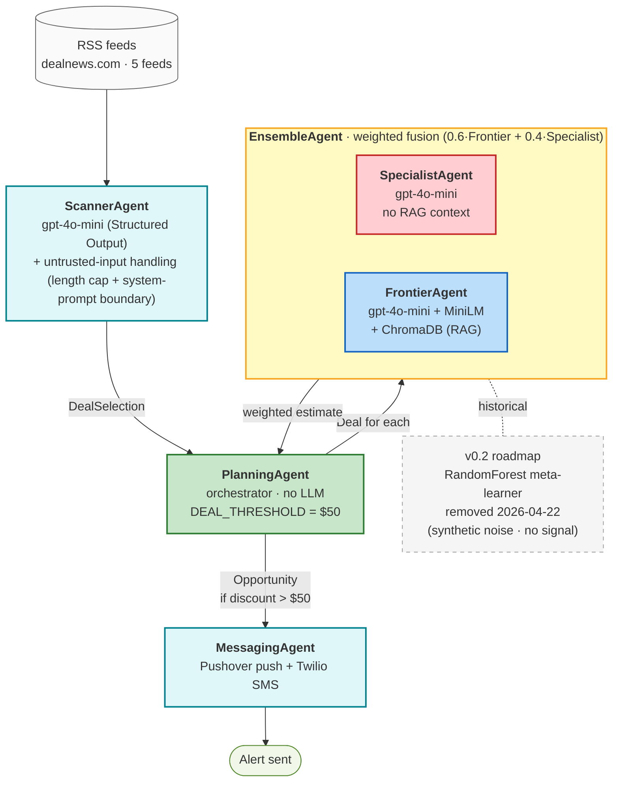

# Multimodal Assistant (Offline/Online Switch)

Autonomous multi-agent deal-hunting pipeline: scrapes product deal RSS feeds,
filters opportunities with a scanner, estimates a fair price through an
ensemble of two pricing agents, and alerts the user when the discount crosses
a threshold. Runs fully offline on heuristics or online against the OpenAI
API via a per-agent toggle.

## Architecture



## Origin & Attribution

This project started as my capstone from **Ed Donner's
[LLM Engineering course](https://github.com/ed-donner/llm_engineering)**
(Week 8, *Project 8 — Autonomous multi-agent deal-spotter*). The 6-agent
architecture (Planning → Scanner → Ensemble[Frontier + Specialist] → Messaging)
and the Modal-based fine-tune serving file (`pricer_service2.py`) are adapted
from the course template — see the header comment in `pricer_service2.py` and
the `HF_USER = "ed-donner"` reference that pins the serverless model revision
to the course instructor's Hugging Face run.

I kept the course's agent scaffolding so the pipeline matches the original
teaching material, and built out the pieces below on top of it for this
portfolio release.

### My modifications

1. **Offline/online dual mode with per-agent toggles** — env-driven
   (`APP_MODE`, `SCANNER_USE_LLM`, `FRONTIER_USE_LLM`), singleton OpenAI
   client, heuristic fallback inside each agent so the whole pipeline runs
   without API keys for local demos and free-tier deployments. The course
   capstone is online-only.
2. **Untrusted-input handling in `ScannerAgent`** — RSS content from
   third-party deal sites is treated as data, not instructions: the
   user-prompt section labels the scraped block as untrusted, the
   system prompt forbids following instructions found inside it, and a
   per-field length cap bounds token cost and attack surface
   (`scanner_agent.py:11-38`). Regex blacklists for jailbreak phrases
   were deliberately omitted — trivially bypassed (homoglyphs, base64,
   language switches) and give false confidence; the model-layer
   separation is what actually constrains the attacker. Not present in
   the course template.
3. **Honest ensemble refactor from 3-agent to 2-agent** — the course's
   ensemble stacks `SpecialistAgent + FrontierAgent + NeuralNetworkAgent`
   through a `Preprocessor`, with weights `0.8·Frontier + 0.1·Specialist +
   0.1·NeuralNetwork`. An earlier revision of this project replaced the
   NeuralNetwork with a RandomForest meta-learner of my own; it was trained
   on synthetic noise and added no real signal, so I removed the meta-learner
   experiment in favor of a transparent `0.6·Frontier + 0.4·Specialist`
   weighted fusion. Rationale is documented in `ensemble_agent.py:1-7`; an
   ML meta-learner trained on a real labeled dataset is tracked as a v0.2
   roadmap item.
4. **Twilio SMS fallback + defensive messaging** — extended the course's
   single-channel Pushover integration with a Twilio SMS channel, graceful
   degradation on missing credentials, an import guard for the optional
   `twilio` package, and handling of Pushover's quirky "HTTP 200 with
   failure status in the JSON body" response mode
   (`messaging_agent.py:50-61`).
5. **Hugging Face Spaces deployment** — Gradio UI shipped to HF Spaces with
   an ephemeral-storage workaround for ChromaDB model caches, automatic
   recovery from a corrupted Chroma state on cold start
   (`app/ui.py:28-38`), and env-driven feature flags so the free-tier Space
   runs in offline/heuristic mode without secrets. The course demos run
   locally.

## Quickstart
```bash
python3 -m venv venv && source venv/bin/activate
pip install -r requirements.txt
cp .env.example .env
# OFFLINE:
export APP_MODE=offline
python app/run_planner.py

# ONLINE (OpenAI):
export APP_MODE=online
export LLM_PROVIDER=openai
export OPENAI_API_KEY=sk-...
python app/run_planner.py
```

## UI (Gradio)
```bash
# OFFLINE
export APP_MODE=offline
python app.py

# ONLINE (OpenAI)
export APP_MODE=online
export LLM_PROVIDER=openai
export OPENAI_API_KEY=sk-...
python app.py
```
