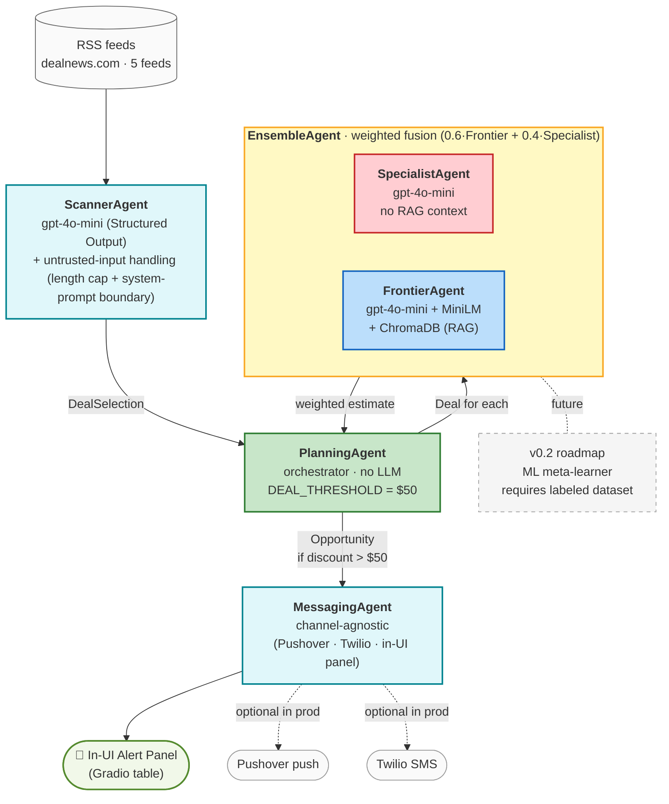

# Multimodal Assistant (Offline/Online Switch)

[](https://github.com/TatianaG-ka/Multimodal_Assistant/actions/workflows/main.yml)

Autonomous multi-agent deal-hunting pipeline: scrapes product deal RSS feeds,
filters opportunities with a scanner, estimates a fair price through an
ensemble of two pricing agents, and alerts the user when the discount crosses
a threshold. Runs fully offline on heuristics or online against the OpenAI
API via a per-agent toggle.

The pipeline is composed of **6 coordinated components — 3 LLM agents
(Scanner, Specialist, Frontier) plus 3 orchestrators (Planning, Ensemble
weighted fusion, Messaging)**. The same architecture is domain-agnostic:
multi-source ingest → multi-agent estimate → threshold alert applies just as
well to fraud detection, dynamic pricing, or SecOps anomaly triage — deals
are chosen as the demo domain because results are verifiable in seconds.

## Architecture


```mermaid
flowchart TD
    RSS[("RSS feeds<br/>dealnews.com · 5 feeds")]
    Scanner["<b>ScannerAgent</b><br/>gpt-4o-mini (Structured Output)<br/>+ untrusted-input handling (length cap + system-prompt boundary)"]
    Planning["<b>PlanningAgent</b><br/>orchestrator · no LLM<br/>DEAL_THRESHOLD = $50"]

    subgraph Ensemble["<b>EnsembleAgent</b> · weighted fusion (0.6·Frontier + 0.4·Specialist)"]
        direction LR
        Specialist["<b>SpecialistAgent</b><br/>gpt-4o-mini<br/>no RAG context"]
        Frontier["<b>FrontierAgent</b><br/>gpt-4o-mini + MiniLM<br/>+ ChromaDB (RAG)"]
    end

    Messaging["<b>MessagingAgent</b><br/>channel-agnostic<br/>(Pushover · Twilio · in-UI panel)"]
    UIPanel(["🔔 In-UI Alert Panel<br/>(Gradio table)"])
    Pushover(["Pushover push"])
    Twilio(["Twilio SMS"])

    RSS --> Scanner
    Scanner -->|DealSelection| Planning
    Planning -->|Deal for each| Ensemble
    Ensemble -->|weighted estimate| Planning
    Planning -->|Opportunity<br/>if discount > $50| Messaging
    Messaging --> UIPanel
    Messaging -.optional in prod.-> Pushover
    Messaging -.optional in prod.-> Twilio

    RF["v0.2 roadmap<br/>ML meta-learner<br/>requires labeled dataset"]
    Ensemble -.future.- RF

    style Scanner fill:#e0f7fa,stroke:#00838f,stroke-width:2px
    style Planning fill:#c8e6c9,stroke:#2e7d32,stroke-width:2px
    style Ensemble fill:#fff9c4,stroke:#f9a825,stroke-width:2px
    style Specialist fill:#ffcdd2,stroke:#c62828,stroke-width:2px
    style Frontier fill:#bbdefb,stroke:#1565c0,stroke-width:2px
    style Messaging fill:#e0f7fa,stroke:#00838f,stroke-width:2px
    style RSS fill:#fafafa,stroke:#616161
    style UIPanel fill:#f1f8e9,stroke:#558b2f,stroke-width:2px
    style Pushover fill:#fafafa,stroke:#9e9e9e
    style Twilio fill:#fafafa,stroke:#9e9e9e
    style RF fill:#f5f5f5,stroke:#9e9e9e,stroke-dasharray: 5 5
```

## Origin & Attribution

This project started as my capstone from **Ed Donner's
[LLM Engineering course](https://github.com/ed-donner/llm_engineering)**
(Week 8, *Project 8 — Autonomous multi-agent deal-spotter*). The
6-component scaffold (Planning → Scanner → Ensemble[Frontier + Specialist] →
Messaging) and the Modal-based fine-tune serving file (`pricer_service2.py`)
are adapted from the course template — see the header comment in
`pricer_service2.py` and the `HF_USER = "ed-donner"` reference that pins the
serverless model revision to the course instructor's Hugging Face run.

I kept the course's agent scaffolding so the pipeline matches the original
teaching material, and built out the pieces below on top of it for this
portfolio release.

### My modifications

1. **Offline/online dual mode with per-agent toggles** — env-driven
   (`APP_MODE`, `SCANNER_USE_LLM`, `FRONTIER_USE_LLM`), singleton OpenAI
   client, heuristic fallback inside each agent so the whole pipeline runs
   without API keys for local demos and free-tier deployments. The course
   capstone is online-only.
2. **Untrusted-input handling in `ScannerAgent`** — RSS content from
   third-party deal sites is treated as data, not instructions: the
   user-prompt section labels the scraped block as untrusted, the
   system prompt forbids following instructions found inside it, and a
   per-field length cap bounds token cost and attack surface
   (`scanner_agent.py:11-38`). Regex blacklists for jailbreak phrases
   were deliberately omitted — trivially bypassed (homoglyphs, base64,
   language switches) and give false confidence; the model-layer
   separation is what actually constrains the attacker. Not present in
   the course template.
3. **Transparent weighted fusion instead of a black-box meta-learner** —
   the course's ensemble stacks `SpecialistAgent + FrontierAgent +
   NeuralNetworkAgent` through a `Preprocessor`, with weights `0.8·Frontier +
   0.1·Specialist + 0.1·NeuralNetwork`. The NeuralNetwork branch was a
   third estimator with no real labeled training data behind it, so an
   earlier revision of this project replaced it with a RandomForest of my
   own — also trained on synthetic noise. I removed the meta-learner
   experiment entirely in favor of an explicit `0.6·Frontier +
   0.4·Specialist` weighted fusion: without a labeled (description, true
   price) dataset, any meta-learner is fitting noise; transparent weights
   are honest about what the system actually knows. Rationale lives in
   `ensemble_agent.py:1-7`. A real ML meta-learner backed by a labeled
   dataset is tracked as a v0.2 roadmap item.
4. **Twilio SMS fallback + defensive messaging** — extended the course's
   single-channel Pushover integration with a Twilio SMS channel, graceful
   degradation on missing credentials, an import guard for the optional
   `twilio` package, and handling of Pushover's quirky "HTTP 200 with
   failure status in the JSON body" response mode
   (`messaging_agent.py:50-61`).
5. **Hugging Face Spaces deployment** — Gradio UI shipped to HF Spaces with
   an ephemeral-storage workaround for ChromaDB model caches, automatic
   recovery from a corrupted Chroma state on cold start
   (`app/ui.py:28-38`), and env-driven feature flags so the free-tier Space
   runs in offline/heuristic mode without secrets. The course demos run
   locally.
6. **In-UI Alert Panel + per-scan cost estimate** — the Gradio app renders
   two tables (all evaluated deals + the subset above the `$50` discount
   threshold) and the status bar shows an estimated per-scan cost in USD
   for online mode (e.g. `est. ~$0.0014 (7 LLM calls @ gpt-4o-mini)`). The
   Alert Panel surfaces what `MessagingAgent` would push to Pushover /
   Twilio in production — without requiring an external service or
   recruiter-side credentials. Decision logic (when to alert) is kept
   separate from channel (where to alert) so the same opportunity stream
   feeds both the in-UI panel and the production SMS / push path.

## Tests

11 unit tests covering the four orchestration paths most likely to silently
break the pipeline in production:

| Module | What is locked down |
|---|---|
| `ScannerAgent` | URL dedupe vs prior alerts, heuristic fallback when `USE_LLM=false`, recovery when OpenAI raises `APIError` |
| `FrontierAgent` | per-call similars cache (avoids double Chroma + double embed), mean-of-RAG fallback when LLM disabled |
| `PlanningAgent` | empty-selection short-circuit (no wasted LLM calls), strict `> threshold` alert gate |
| `EnsembleAgent` | weighted fusion math (0.6·Frontier + 0.4·Specialist), graceful degradation when one estimator fails, total-failure → `0.0` |

All tests are pure unit tests — Chroma collection is mocked, OpenAI clients
are mocked, `SentenceTransformer` is stubbed at module-import time so no
~90 MB embedding model is downloaded during test runs.

```bash
pip install pytest pytest-mock
pytest                           # 11 passed in ~7s
```

CI runs the suite on every push and PR; the HF Space sync only fires after
tests pass green (see `.github/workflows/main.yml`).

## Quickstart
```bash
python3 -m venv venv && source venv/bin/activate
pip install -r requirements.txt
cp .env.example .env
# OFFLINE:
export APP_MODE=offline
python app/run_planner.py

# ONLINE (OpenAI):
export APP_MODE=online
export LLM_PROVIDER=openai
export OPENAI_API_KEY=sk-...
python app/run_planner.py
```

## UI (Gradio)
```bash
# OFFLINE
export APP_MODE=offline
python app.py

# ONLINE (OpenAI)
export APP_MODE=online
export LLM_PROVIDER=openai
export OPENAI_API_KEY=sk-...
python app.py
```
